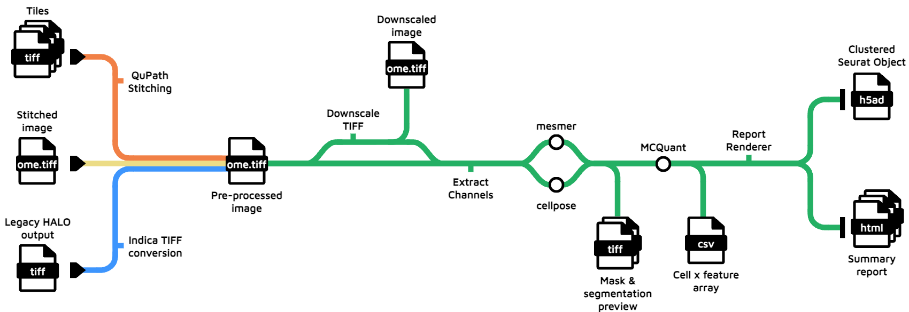

<h1>
  <picture>
    <source media="(prefers-color-scheme: dark)" srcset="docs/images/nf-core-mihcro_logo_dark.png">
    
  </picture>
</h1>

## Introduction

**nf-core/mihcro** is a bioinformatics pipeline designed to streamline the analysis of multiplex immunohistochemsitry (mIHC) samples.

The purpose of the pipeline is to convert tiled or stitched multi-channel microscopy images into clean single-cell data. It takes as input a samplesheet, and an optional list of markers present on the panel. It stitches images together if required, performs cell segmentation on the DAPI channel, quantifies outputs into single-cell format and then runs a few basic clustering analyses.

The segmentation model to be used can be selected (currently mesmer is default, and cellpose is also available). By default, the pipeline performs segmentation on the DAPI marker, but there is also the option to specify a membrane marker with which to segment whole cells. There are also optional preprocessing steps prior to segmentation for speed and accuracy, including DAPI background removal, Otsu thresholding, and downscaling to 1um/pixel scale.

The pipeline returns a processed TIFF file, a segmented image mask and summary, a cell x feature spreadsheet, as well as an HTML report on the cell x feature data, including segmentation summary statistics, marker intensity summary statistics, and UMAP reduction and clustering.

The pipeline accepts three main formats of input:
* Tiled microscopy images
* Pre-stitched microscopy images (ome.tiff files), from software such as [QuPath](https://qupath.github.io/) or [HALO (software versions v4.0+)](https://indicalab.com/halo/)
* Microscopy images output from older version of HALO, which are indica-formatted .tiff files.



## Usage

> [!NOTE]
> If you are new to Nextflow and nf-core, please refer to [this page](https://nf-co.re/docs/usage/installation) on how to set-up Nextflow. Make sure to [test your setup](https://nf-co.re/docs/usage/introduction#how-to-run-a-pipeline) with `-profile test` before running the workflow on actual data.

First, prepare a samplesheet that follows the format below:

`example_samplesheet.csv`:

```csv
sample,tiffs,format
EXAMPLE_SAMPLE_NAME,/path/to/tiff/directory,tiles
```

Each row represents a directory which contains several .tiff tiles, or a single stitched .tiff or .ome.tiff.

The `format` column must be one of the following for each sample:
* `tiles` for tiled inputs
* `stitched` for pre-stitched, ome-tiff inputs
* `fused` for legacy HALO outputs (indica-format tiff files)

Next, you'll need to prepare a list of your markers, which will look something like this:

`example_markers.csv`:

```csv
marker_name
DAPI
PTPRC
HMWCK
CD3
CD11c
```

Each row represents a different channel in your images. Note that marker names cannot contain spaces!

Now, you can run the pipeline using the following basic parameters:

```bash
nextflow run nf-core/mihcro \
   -profile <docker/singularity/.../institute> \
   --input example_samplesheet.csv \
   --markers example_markers.csv \
   --outdir <OUTDIR>
```
> [!NOTE]
> At this stage of development, this pipeline only works with container `-profile` options (e.g. apptainer, docker, singluarity).

> [!WARNING]
> Please provide pipeline parameters via the CLI or Nextflow `-params-file` option. Custom config files including those provided by the `-c` Nextflow option can be used to provide any configuration _**except for parameters**_; see [docs](https://nf-co.re/docs/usage/getting_started/configuration#custom-configuration-files).

For more details and further functionality, please refer to the [usage documentation](docs/usage.md).

## Pipeline output

The pipeline returns:
* A processed TIFF file in the OME-TIFF format
* A segmented image mask and summary image of the segmentation output, with DAPI in blue and segmentation borders in red.
* A cell x feature spreadsheet output by MCQuant
* An HTML report on the cell x feature data, including:
  * Segmentation summary statistics and basic QC
  * Marker intensity summary statistics
  * UMAP reduction, and clustering
  * Overviews of the marker signal in clusters
  * Spatial map of marker singal and cluster assignment

For more details about the output files and reports, and for examples of output from a full dataset, please refer to the
[output documentation](docs/output.md).

## Credits

nf-core/mihcro was originally written by Song Li.

We thank the following people for their extensive assistance in the development of this pipeline:
  * Patrick Crock
  * Qing Siaw
  * Xuhan Zhang


## Contributions and Support

If you would like to contribute to this pipeline, please see the [contributing guidelines](.github/CONTRIBUTING.md).

<!-- For further information or help, don't hesitate to get in touch on the [Slack `#mihcro` channel](https://nfcore.slack.com/channels/mihcro) (you can join with [this invite](https://nf-co.re/join/slack)). -->

## Citations

<!-- TODO nf-core: Add citation for pipeline after first release. Uncomment lines below and update Zenodo doi and badge at the top of this file. -->
<!-- If you use nf-core/mihcro for your analysis, please cite it using the following doi: [10.5281/zenodo.XXXXXX](https://doi.org/10.5281/zenodo.XXXXXX) -->

<!-- TODO nf-core: Add bibliography of tools and data used in your pipeline -->

An extensive list of references for the tools used by the pipeline can be found in the [`CITATIONS.md`](CITATIONS.md) file.

You can cite the `nf-core` publication as follows:

> **The nf-core framework for community-curated bioinformatics pipelines.**
>
> Philip Ewels, Alexander Peltzer, Sven Fillinger, Harshil Patel, Johannes Alneberg, Andreas Wilm, Maxime Ulysse Garcia, Paolo Di Tommaso & Sven Nahnsen.
>
> _Nat Biotechnol._ 2020 Feb 13. doi: [10.1038/s41587-020-0439-x](https://dx.doi.org/10.1038/s41587-020-0439-x).
