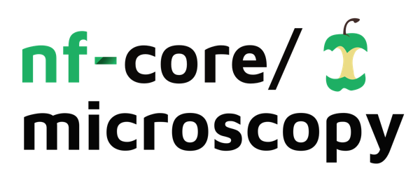

<h1>
  <picture>
    <source media="(prefers-color-scheme: dark)" srcset="docs/images/nf-core-microscopy_logo_dark.png">
    
  </picture>
</h1>

## Introduction

**nf-core/microscopy** is a bioinformatics pipeline designed to streamline the analysis of multiplex immunohistochemsitry (mIHC) samples.

The purpose of the pipeline is to convert tiled or stitched multi-channel microscopy images into clean single-cell data. It takes as input a samplesheet, and an optional list of markers present on the panel. It stitches images together, performs cell segmentation on the DAPI channel, quantifies outputs into single-cell format and then runs a few basic clustering analyses.

The segmentation model to be used can be selected (currently mesmer is default, and cellpose is also available). The pipeline returns a stitched image file, segmented image mask, cell x feature spreadsheet, as well as UMAP representations of the data clustered using various methods.


## Usage

> [!NOTE]
> If you are new to Nextflow and nf-core, please refer to [this page](https://nf-co.re/docs/usage/installation) on how to set-up Nextflow. Make sure to [test your setup](https://nf-co.re/docs/usage/introduction#how-to-run-a-pipeline) with `-profile test` before running the workflow on actual data.

First, prepare a samplesheet that looks as follows:

`samplesheet.csv`:

```csv
sample,tiffs
SAMPLE_NAME,/path/to/tiff/directory
```

Each row represents a directory which contains several .tiff tiles.

Next, you'll need to prepare a list of your markers:

`markers.csv`:

```csv
marker_name
DAPI
PTPRC
HMWCK
CD3
CD11c
```

Each row represents a different channel in your images. Note that marker names cannot contain spaces!

Now, you can run the pipeline using:

```bash
nextflow run nf-core/microscopy \
   -profile <docker/singularity/.../institute> \
   --input samplesheet.csv \
   --markers markers.csv \
   --outdir <OUTDIR>
```

> [!WARNING]
> Please provide pipeline parameters via the CLI or Nextflow `-params-file` option. Custom config files including those provided by the `-c` Nextflow option can be used to provide any configuration _**except for parameters**_; see [docs](https://nf-co.re/docs/usage/getting_started/configuration#custom-configuration-files).

For more details and further functionality, please refer to the [usage documentation](https://nf-co.re/microscopy/usage) and the [parameter documentation](https://nf-co.re/microscopy/parameters).

## Pipeline output

To see the results of an example test run with a full size dataset refer to the [results](https://nf-co.re/microscopy/results) tab on the nf-core website pipeline page.
For more details about the output files and reports, please refer to the
[output documentation](https://nf-co.re/microscopy/output).

## Credits

nf-core/microscopy was originally written by Song Li.

We thank the following people for their extensive assistance in the development of this pipeline:
  * Patrick Crock


## Contributions and Support

If you would like to contribute to this pipeline, please see the [contributing guidelines](.github/CONTRIBUTING.md).

For further information or help, don't hesitate to get in touch on the [Slack `#microscopy` channel](https://nfcore.slack.com/channels/microscopy) (you can join with [this invite](https://nf-co.re/join/slack)).

## Citations

<!-- TODO nf-core: Add citation for pipeline after first release. Uncomment lines below and update Zenodo doi and badge at the top of this file. -->
<!-- If you use nf-core/microscopy for your analysis, please cite it using the following doi: [10.5281/zenodo.XXXXXX](https://doi.org/10.5281/zenodo.XXXXXX) -->

<!-- TODO nf-core: Add bibliography of tools and data used in your pipeline -->

An extensive list of references for the tools used by the pipeline can be found in the [`CITATIONS.md`](CITATIONS.md) file.

You can cite the `nf-core` publication as follows:

> **The nf-core framework for community-curated bioinformatics pipelines.**
>
> Philip Ewels, Alexander Peltzer, Sven Fillinger, Harshil Patel, Johannes Alneberg, Andreas Wilm, Maxime Ulysse Garcia, Paolo Di Tommaso & Sven Nahnsen.
>
> _Nat Biotechnol._ 2020 Feb 13. doi: [10.1038/s41587-020-0439-x](https://dx.doi.org/10.1038/s41587-020-0439-x).
