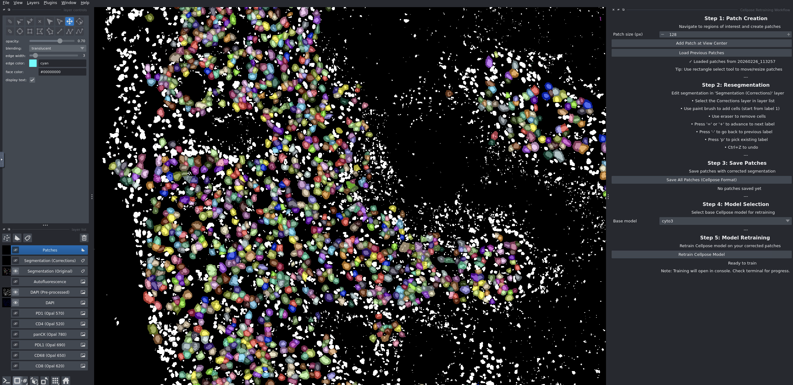
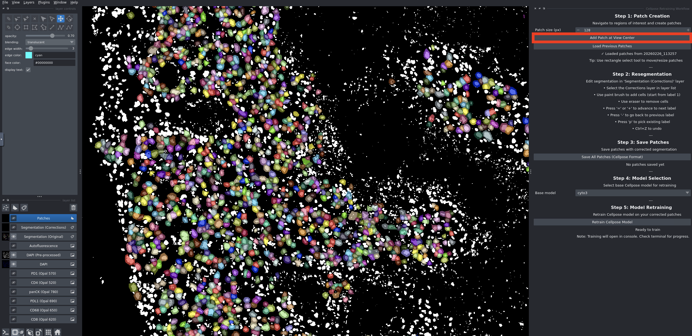
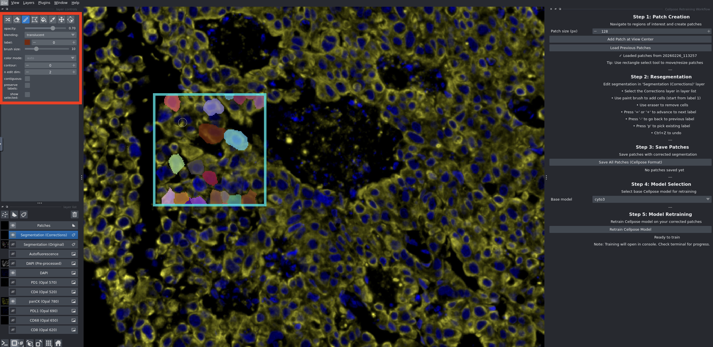

# nf-core/mihcro: Cellpose Segmentation

## Contents

- [Overview](#overview)
- [Enabling Cellpose](#enabling-cellpose)
- [Parameters](#parameters)
  - [Model selection](#model-selection)
    - [Fine-tuning a model](#fine-tuning-a-model)
  - [Cell diameter](#cell-diameter)
  - [Membrane channel](#membrane-channel)
  - [Additional arguments](#additional-arguments)
- [Two-channel segmentation](#two-channel-segmentation)
- [Notes and limitations](#notes-and-limitations)

## Overview

[Cellpose](https://www.cellpose.org/) is a generalised cell segmentation model available as an alternative to the default Mesmer segmentation in this pipeline. It supports nuclear-only segmentation as well as two-channel segmentation using a nuclear marker alongside a membrane or cytoplasmic stain.

## Enabling Cellpose

To run Cellpose instead of Mesmer, set the `--segmentation` parameter:

```bash
--segmentation cellpose
```

> [!IMPORTANT]
> Cellpose is not supported with the `conda` or `mamba` profiles. You must use a container-based profile (Docker, Singularity, Apptainer, Podman, etc.).

## Parameters

### Model selection

- `--cellpose_model` (string, default: bundled `cyto3`): Path to a pretrained Cellpose model.

By default, the pipeline uses the `cyto3` model bundled with the container, which is a robust general-purpose cytoplasm model suited to most nuclear stains. To use a custom or fine-tuned model, provide the path to the model file:

```bash
--cellpose_model /path/to/my_custom_model
```

Custom models can be trained via the [Cellpose GUI or Python API](https://cellpose.readthedocs.io/en/latest/train.html) and then passed directly to the pipeline this way.

#### Fine-tuning a model

Included with this pipeline is a [python script](../assets/helper_scripts/cellpose_resegmentation/run_reseg.py) which will launch a re-segmentation GUI through napari. This script is designed to recognise the outputs of the pipeline, and provide an easy, relatively bug-free method to specify cell borders. Expand the topic below for a full tutorial on the use of this tool:

<details>
<summary><b>Using the resegmentation script</b></summary>


**Installation**

This resegmentation tool should take roughly 5-10 minutes to install. As a prerequisite, please install [Miniconda](https://docs.conda.io/en/latest/miniconda.html) or [Anaconda](https://www.anaconda.com/download) if you don't already have it. After installation, restart your terminal (or computer on Windows) to ensure conda is available.

1. **Download or copy** `run_reseg.py` and `environment.yml` from the repository, or navigate there if you have cloned the repository.
2. **Open a terminal** in the directory containing these files.
3. **Create the conda environment:**
  ```bash
  conda env create -f environment.yml
  ```

4. **Wait** for installation to complete (~5-10 minutes).

> **Tip**: You only need to create the environment once. For subsequent runs, just activate the environment and run the script.

**Running the Program**

1. **Activate the environment:**
   ```bash
   conda activate cellpose_reseg
   ```

2. **Run the script:**
   ```bash
   python run_reseg.py
   ```

3. When prompted, **select your pipeline results directory** (the folder containing `image_downscale/`, `segmentation/`, etc.).
4. After loading your images, the tool will open a napari viewer window similar to the one pictured below:



> **Tip** You can hide/show layers, including all markers in your image, at the bottom-left-hand corner of the UI.

5. Find areas where the segmentation is unsatisfactory, and **click the "Add Patch at View Center"** button to make a retraining patch. (you can change the size of this patch with the buttons above)



6. Select the **Segmentation (Corrections)** layer, and **paint in your new cells** with the paintbrush button (press `+` or `=` to advance the labels between cells) **inside each of your patches**.



7. **Save your patches** with the "Save All Patches (Cellpose Format)" button.

8. Select your model (you can link to `mihcro/bin/cyto3` to avoid downloading the default model), and then click "Retrain Cellpose Model" to **retrain your model**.

9. You can find your newly trained model in the results folder under `patches/models/`, and use it in subsequent mihcro runs with `--cellpose_model /path/to/results/patches/models/{model}`

</details>


### Cell diameter

- `--cellpose_diam` (integer, default: `15`): Expected cell diameter in pixels.

This is one of the most important parameters to tune for your data. It tells Cellpose the approximate size of the objects to segment, and has a large impact on segmentation quality. If left unset, Cellpose will attempt to estimate the diameter automatically, though this is less reliable than providing a value derived from your data.

> [!TIP]
> A quick way to estimate the right diameter is to open your DAPI image in the Cellpose GUI, run the diameter estimation tool, and note the value it returns. You can then use that value here.

The appropriate diameter will depend on both the cell type and the image resolution. If your pipeline is run with `--downscale_mode 1um` (the default), the image will be at 1 µm/pixel, so `--cellpose_diam` corresponds approximately to cell diameter in microns.

### Membrane channel

- `--membrane_channel` (string): Name of the membrane or cytoplasmic marker channel to use alongside the nuclear channel.

When specified, the pipeline runs a preprocessing step that stacks the membrane and nuclear channels into a two-channel image, which is then passed to Cellpose for whole-cell segmentation. See [Two-channel segmentation](#two-channel-segmentation) for details.

### Additional arguments

Any additional Cellpose CLI arguments can be passed through to the process via `task.ext.args` in your Nextflow config. For example, to enable flow threshold adjustment:

```groovy
process {
    withName: 'CELLPOSE' {
        ext.args = '--flow_threshold 0.8 --cellprob_threshold -1'
    }
}
```

A full list of available Cellpose CLI arguments can be found in the [Cellpose documentation](https://cellpose.readthedocs.io/en/latest/command.html).

## Two-channel segmentation

When `--membrane_channel` is specified, the pipeline runs a preprocessing step (`PREPROCESS_CELLPOSE`) prior to segmentation. This step stacks the membrane and nuclear channel images into a two-channel TIFF in the order `[membrane, nuclear]`, which is then passed to Cellpose with the following channel configuration:

- Channel 0 (`--chan 0`): membrane channel — the primary channel Cellpose segments around
- Channel 1 (`--chan2 1`): nuclear channel — used as a localisation guide for cell centres

This approach tends to produce more accurate whole-cell boundaries compared to nuclear-only segmentation, particularly in tissues with dense or overlapping cells. It requires that a suitable membrane or cytoplasmic marker (e.g. pan-cytokeratin, CD45, E-cadherin) is present in your panel.

To enable two-channel segmentation, set both `--segmentation` and `--membrane_channel`:

```bash
--segmentation cellpose \
--membrane_channel 'PanCK'
```

The channel name must match exactly what is listed in your markerfile.

## Notes and limitations

- **Conda is not supported.** The Cellpose module requires a container profile. Attempting to run with `conda` or `mamba` will produce an error.
- **Model bundling.** The `cyto3` model is bundled inside the container rather than downloaded at runtime, which improves reproducibility and avoids network dependency during execution.
- **Thread control.** The process sets `OMP_NUM_THREADS` and `MKL_NUM_THREADS` to match the number of CPUs allocated to the task, which can be tuned via your resource configuration if needed.
- **GPU acceleration.** The default container does not enable GPU support. If GPU acceleration is required, a custom container with CUDA support would need to be specified via `task.ext.container` or an equivalent config override.
