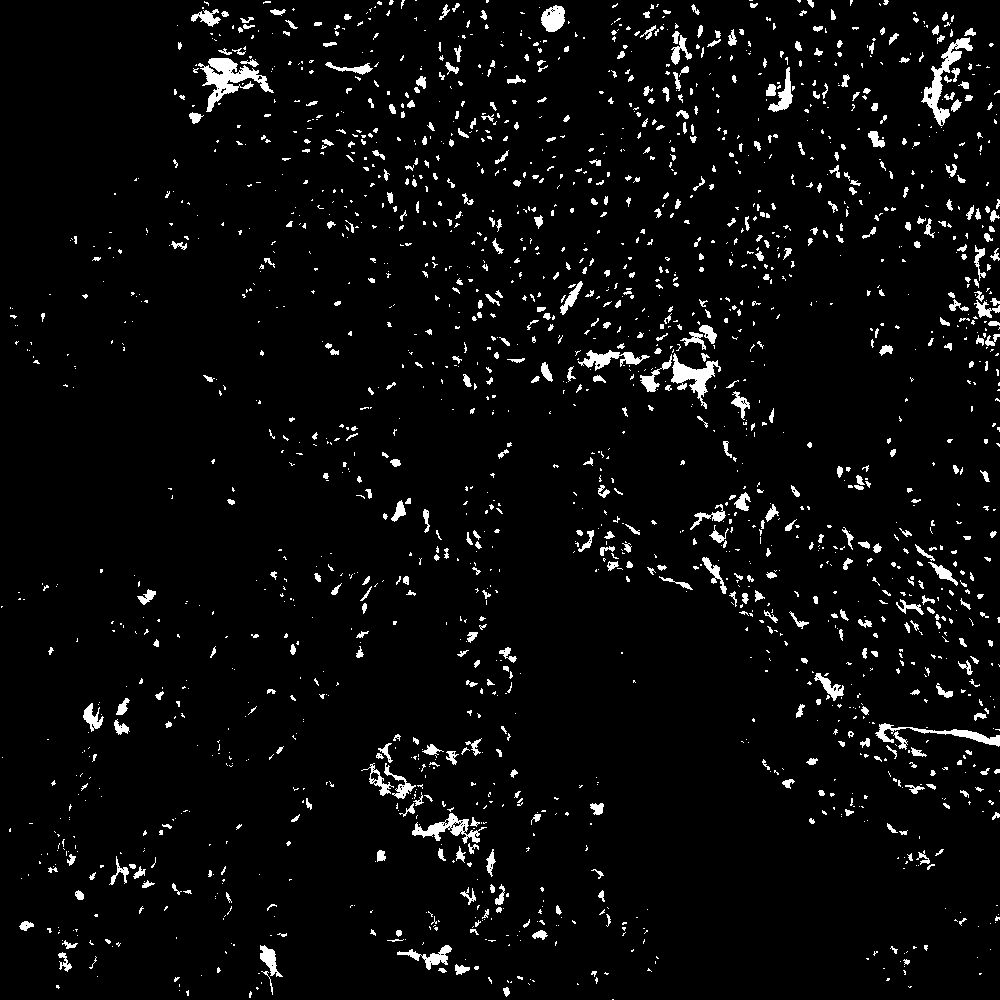
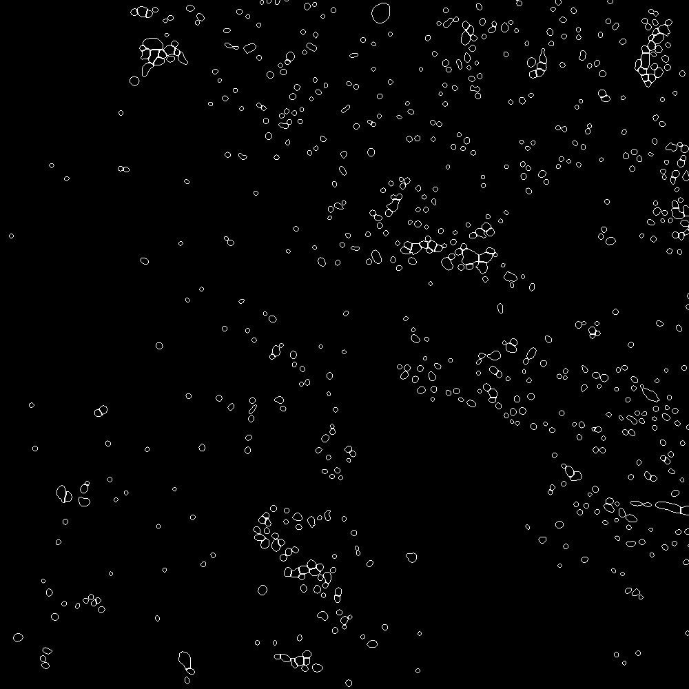
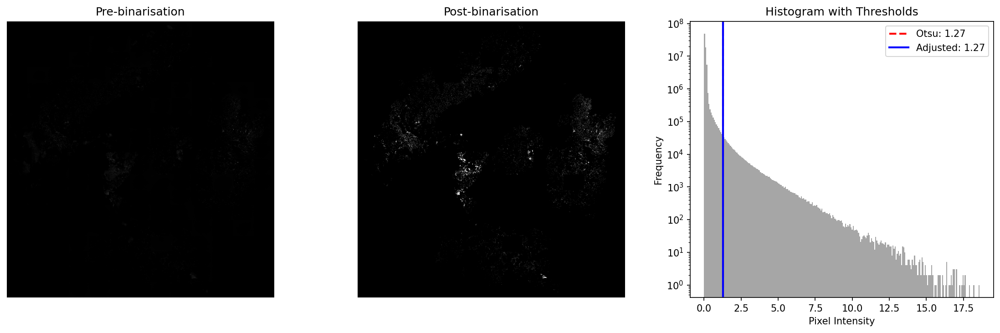
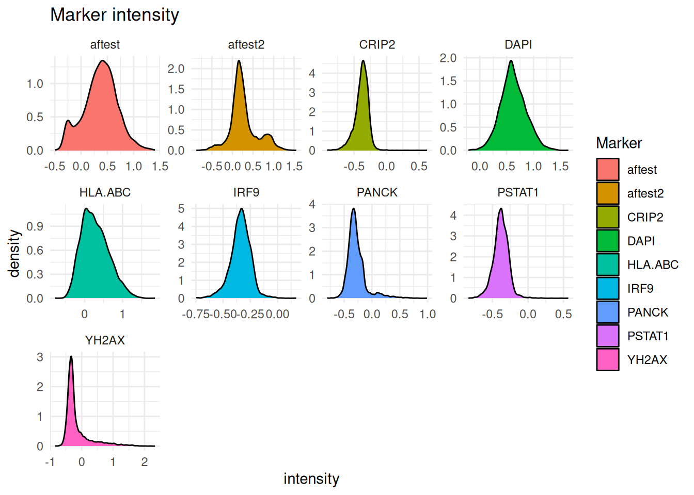
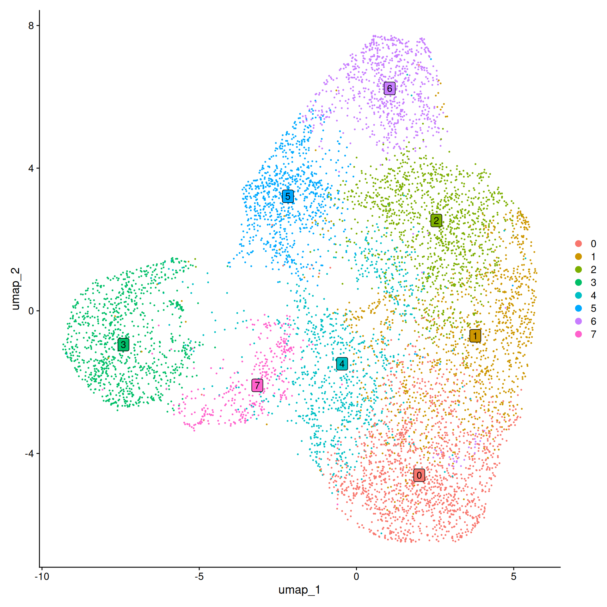
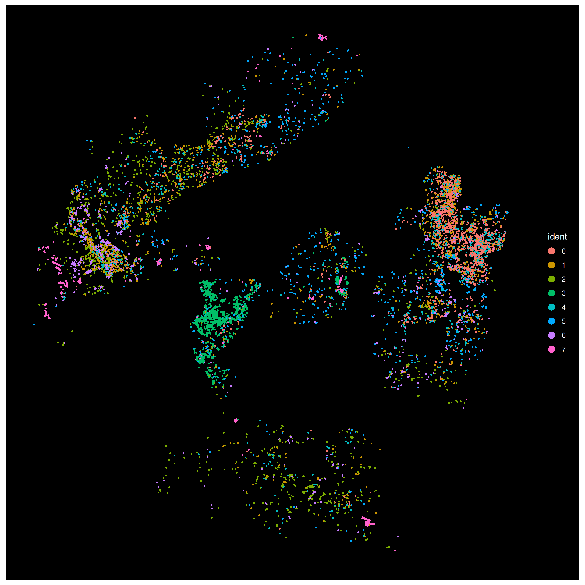
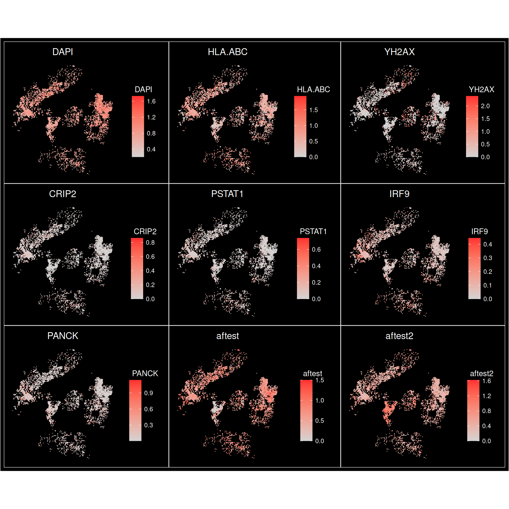

# nf-core/mihcro: Output

## Introduction

This document describes the output produced by the pipeline.

The directories listed below will be created in the results directory after the pipeline has finished. All paths are relative to the top-level results directory.

<!-- TODO nf-core: Write this documentation describing your workflow's output -->

## Pipeline overview

The pipeline is built using [Nextflow](https://www.nextflow.io/) and processes data using the following steps:

- [Main outputs](#main-outputs) - Images and HTMLs detailing major steps in the pipeline or analysis results
- [Intermediate outputs](#intermediate-outputs) - Files produced during workflow execution that are used further downstream
- [Pipeline information](#pipeline-information) - Report metrics generated during the workflow execution

> [!TIP]
> Example images of outputs are present in the [Example outputs](#example-outputs) section.

### Main outputs

Output files

- `reports/`
  - The HTML output from the R analysis step: `<SAMPLENAME>_report.html`
- `images/`
  - Output segmentation image: `<SAMPLENAME>_bw_boundaries.tiff`, which contains two channels: one with the processed DAPI, the other with the segmentation borders, both in black-and-white.
  - Rendering of the segmentation borders (red) over the DAPI values (blue) in TIFF format: `<SAMPLENAME>_rgb_boundaries.tiff`
- `dapi_processed/`
  - This directory will only be present if DAPI preprocessing was used in the pipeline.
  - A TIFF image of the DAPI channel post background removal (if executed) and binarisation: `<SAMPLENAME>_dapi_processed.tif`
  - A PNG image showing an overview of the DAPI channel pre- and post- processing, as well as a representative histogram with Otsu threshold drawn: `<SAMPLENAME>_dapi_diagnostic.png`

### Intermediate outputs

Output files

- `[SAMPLENAME]/`
  - `extracted_channel/`
    - The extracted DAPI channel used in segmentation: `<SAMPLENAME>_dapi.tif`
    - If AF subtraction method was used in DAPI preprocessing, the extracted channel will also be found: `<SAMPLENAME>_AF.tif`
  - `mesmer/` or `cellpose/`
    - The segmentation mask output from mesmer (default): `<SAMPLENAME>_mesmer.tif`
    - `mcquant/`
      - The cell-by-feature matrix output from MCQuantL: `<SAMPLENAME>.csv`
  - `metadata/`
    - XML metadata extracted from the TIFF image: `<SAMPLENAME>.xml`
    - If downscaling was performed, this directory will also contain the downscaled TIFF: `<SAMPLENAME>.downscaled.ome.tif`
  - `qupath_stitch/`
    - If input was in the `tiles` format, this directory will be present with the stitched TIFF: `<SAMPLENAME>.ome.tif`

### Pipeline information

Output files

- `pipeline_info/`
  - Reports generated by Nextflow: `execution_report.html`, `execution_timeline.html`, `execution_trace.txt` and `pipeline_dag.dot`/`pipeline_dag.svg`.
  - Reports generated by the pipeline: `pipeline_report.html`, `pipeline_report.txt` and `software_versions.yml`. The `pipeline_report*` files will only be present if the `--email` / `--email_on_fail` parameter's are used when running the pipeline.
  - Reformatted samplesheet files used as input to the pipeline: `samplesheet.valid.csv`.
  - Parameters used by the pipeline run: `params.json`.

## Example outputs

 Segmentation summary images 

These outputs include the following two TIFF images (zoomed in here for the sake of clarity):

`<SAMPLENAME>_bw_boundaries.tiff`

DAPI Channel               |  Segmentation boundaries
:-------------------------:|:-------------------------:
  |  

`<SAMPLENAME>_rgb_boundaries.tiff`

 DAPI preprocessing diagnostic 

Apart from `<SAMPLENAME>_dapi_processed.tif`, which shows the output binarised/background-removed DAPI channel, the DAPI preprocessing step also outputs `<SAMPLENAME>_dapi_diagnostic.png`, an example of which is show below.

This features, from left to right: The raw DAPI channel, processed DAPI channel, and a histogram of DAPI intensities across the sample, with the Otsu threshold derived from the workflow drawn as a vertical line.

 QC and clustering HTML output 

In brief, the QC report outputs the following:

* Tabular QC and statistical overviews for:
  * Segmentation outputs (e.g. cell area, eccentricity, etc.)
  * Inferred marker intensity from MCQuant (Raw, log-transformed, and CLR-transformed)

    **Statistical summary - CLR transformed data**

| Marker   | Mean       | Median     | SD         | Min        | Max       |
|----------|------------|------------|------------|------------|-----------|
| CRIP2    | -0.3847963 | -0.3721695 | 0.1047961  | -0.9138822 | 0.6241850 |
| DAPI     | 0.6234870  | 0.6084664  | 0.2371259  | -0.2121824 | 1.6505124 |
| HLA.ABC  | 0.2781894  | 0.2367254  | 0.3568910  | -0.7763776 | 1.8521508 |
| IRF9     | -0.3403266 | -0.3356826 | 0.0934302  | -0.7458426 | 0.1718112 |
| PANCK    | -0.2773508 | -0.3112169 | 0.1768041  | -0.8039722 | 0.9906032 |
| PSTAT1   | -0.3817753 | -0.3797387 | 0.1076608  | -0.8377921 | 0.5672849 |
| YH2AX    | -0.1487883 | -0.3007846 | 0.4199619  | -0.8465718 | 2.3328215 |

* Graphical overviews of marker intensity distribution, including boxplots and histograms

* Further analysis on marker intensities, including marker correlation analysis, and Quantile-Quantile plots
* UMAP reductions of the CLR-transformed data, grouped by Louvain clustering output at various resolution levels (0.2, 0.3 ... 0.8)

* Spatial representation of the cells grouped by their Louvain clusters (again, at various resolutions)

* Spatial representation of the cells, coloured by their marker intensity levels.

[Nextflow](https://www.nextflow.io/docs/latest/tracing.html) provides excellent functionality for generating various reports relevant to the running and execution of the pipeline. This will allow you to troubleshoot errors with the running of the pipeline, and also provide you with other information such as launch commands, run times and resource usage.
